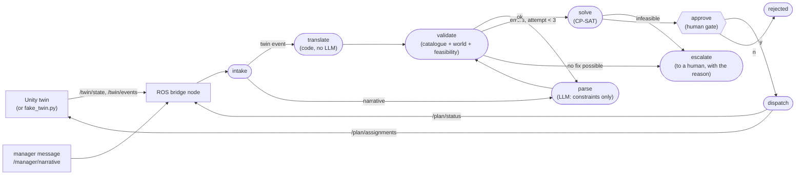

# Site replanner

When something goes wrong on a construction site - a robot breaks down, a delivery runs late - the
day's schedule has to be rebuilt. This rebuilds it in seconds, and checks the new plan before
anyone acts on it.

```
  something goes wrong              what the system does
  --------------------              --------------------

  a robot breaks down  ---+
                          +--->  READ      turn it into one rule
  "racks are 2h late"  ---+                e.g. "robot 2 is out of action"
                                             |
                                           CHECK     is the rule real, and still doable?
                                             |
                                    doable --+-- impossible
                                      |              |
                                   REPLAN         say why, and stop
                                   a new            ("only robot 3 can drill,
                                   schedule          and it is down")
                                      |
                                   APPROVE   a person says go
                                      |
                                    SITE     robots and crew start the new plan
```

Nothing is guessed. The language model only reads the message; the schedule itself is worked out by
a solver, and a person signs it off before any robot moves.

In one line, for engineers: an LLM turns site disruptions into verified constraints; CP-SAT replans
a mixed robot + crew data-center fit-out schedule; a Unity digital twin executes it over ROS 2.

## Demo

The video of the live Unity loop is the one piece still outstanding (initial dispatch, R2 fault
replan, narrative replan with approval, R3 escalation). Until it lands, the whole loop runs headless
in one command, with no API key and no Unity:

```bash
source env.sh
make demo-headless      # bridge + fake twin, robot fault at t=20, replan, dispatch
make demo-escalate      # the drilling robot fails: the system escalates instead of guessing
```

## What it does

- **Two kinds of disruption, two paths.** A twin event (a robot faults) becomes a constraint in
  plain code and never touches the LLM. A manager's sentence ("rack delivery to zone B is delayed by
  two hours") goes to the LLM, which extracts constraints only.
- **Nothing reaches the schedule unverified.** A parse is checked against the task catalogue, the
  world state and the solver itself before anything is scheduled; a failed check is fed back to the
  LLM as an error to fix, up to three attempts.
- **Impossible is a valid answer.** When no schedule satisfies the request, the system escalates with
  the reason ("no available resource has capability 'drill'") instead of dropping the inconvenient
  constraint. A human approves every plan before it is dispatched.

## Architecture



The LLM appears in exactly one node, and that node emits constraints, never a schedule. The solver
is the only source of a plan. A twin event never passes through the LLM.

## Results: single-shot vs. validated loop

24 cases x 2 repeats x 2 arms = 96 runs on `gpt-6-luna`, 104 LLM calls, 140,891 tokens. Both arms
are the same LangGraph graph; the only difference is whether the verifier sits between the parse and
the solver. Mean over the repeats, min-max in brackets.

| arm | correct | unsafe dispatch | escalated | error | recovered by retry | LLM calls | median latency | tokens |
|---|---|---|---|---|---|---|---|---|
| single-shot | 83.3% | 0.0% | 16.7% | 16.7% | 0.0% | 1.00 | 1.91 s (1.90-1.93) | 1340 (1338-1342) |
| validated loop | 100.0% | 0.0% | 33.3% | 0.0% | 16.7% | 1.17 | 2.11 s (2.07-2.14) | 1595 (1591-1600) |

Correct outcome by difficulty:

| arm | easy | medium | hard |
|---|---|---|---|
| single-shot | 100.0% | 100.0% | 60.0% |
| validated loop | 100.0% | 100.0% | 100.0% |

Metric definitions:

- **correct**: the case expected a plan and the arm dispatched the gold constraints, or the case
  expected an escalation and the arm escalated.
- **unsafe dispatch**: a plan went out that should not have - either the case expected an escalation,
  or the constraints differ from the gold. This counts the runs where the loop "fixes" an impossible
  request by quietly weakening it.
- **recovered by retry**: a correct outcome that needed more than one LLM call. Only the validated
  arm can score here; the baseline has nothing to retry against.
- **escalated / error**: deliberately separate. `escalated` is a reasoned hand-off to a human;
  `error` is the solver failing on constraints nothing checked.

What the numbers say, and what they do not:

- The verifier buys **+16.7 points** of correct outcome for 17% more LLM calls and 19% more tokens,
  and all of the gain is in the hard band (60% to 100%).
- The mechanism is visible in the raw rows, and it is the whole result. The four cases the baseline
  loses are H03-H06, where it parses the request *correctly* and then dies in the solver
  (`no plan: no available resource has capability 'drill' (needed by T4)`,
  `no plan: solver returned INFEASIBLE after 5.0s`). That lands as `error`, with nothing said about
  what is wrong. The validated arm reaches the same four cases through the feasibility check, one
  retry each, and an `escalated` status carrying the reason. Same parse, same impossibility: one arm
  hands the human a sentence, the other hands them a solver failure. Every other row in the matrix
  is identical between the arms.
- **Unsafe dispatch is 0.0% in both arms, and that is a fact about this benchmark, not a property of
  the verifier.** The first run of this matrix scored 6.2% and 8.3% on one ambiguous phrase ("the
  zone A racks", which the case templates assign to the rack *delivery* task, T7, and the model read
  as the rack *setting* task, T9, in all six affected runs of both arms). That phrase was replaced
  with "the zone A rack delivery", so the benchmark now contains no semantically ambiguous case, and
  both arms resolve T7 correctly in all eight runs. The class of error has not been solved: a wrong
  but valid ID gives a well-formed constraint and a feasible plan, so verification is structurally
  unable to catch it. Nothing here measures it.
- The validated arm's 100.0% is a ceiling on 24 self-made cases, not a reliability claim. What it
  says is narrower: on this benchmark, every outcome the verifier changes, it changes from an
  unexplained solver failure into a stated escalation.

Regrade any finished run offline, with no API calls:

```bash
python -m mvp.eval.report              # reads runs/eval/raw.jsonl
```

`runs/eval/results.json` records the SHA-256 of `cases.jsonl` and the model ID, so a table can
always be traced back to the exact cases and model that produced it.

## Before and after the replan


Both panels come from the plan files `make demo-headless` writes. Rows are resources, bars are
tasks coloured by zone, the dashed line is `t_now`, and a red outline marks a task the replan moved
to a different resource.

The replan is the interesting part: R2 faults at t=12 with T2 not yet started and T1 reverted to
pending (the twin reverts a faulted resource's task before the bridge replans), the solver puts
both on R1 - the only other transport robot - and **the makespan does not move**. The
175 minutes are set by the chain T2, T6, T5, T10, T9, T11 through the single install-capable crew,
so losing a cargo robot costs nothing until the crew is no longer the bottleneck. A schedule a
human would have redrawn by hand gets re-derived in one solve, with the churn visible and priced
(the objective charges 10 per reassignment, against 1000 per minute of makespan).

```bash
make gantt              # writes docs/replan_r2.png from runs/plans/plan_001.json and plan_002.json
```

## Design decisions

- **The LLM never writes the schedule.** It extracts constraints; CP-SAT assigns resources and
  start times. The failure mode of a language model on a scheduling problem is a plausible-looking
  schedule that violates a precedence nobody checked, so it is never asked for one.
- **Twin events skip the LLM.** A robot fault is already structured. Sending it through a language
  model would add latency, cost and a chance of mistranslation to a message that needs none of it,
  so `translate` does it in about ten lines of Python. A twin event that fails validation escalates
  immediately: there is nobody to re-prompt.
- **The verifier checks meaning, not syntax.** Structured outputs already guarantee the shape. What
  they cannot guarantee is that `T14` exists, that a completed task is not being rescheduled, that a
  new dependency does not close a cycle, or that the result is solvable at all. The last check is a
  real CP-SAT solve, so "I cannot do that" is a fact, not an opinion.
- **A human approves every dispatch.** Approval is its own LangGraph node containing nothing but the
  interrupt, because resuming an interrupt re-runs the node - so neither the LLM nor the solver may
  live inside it.
- **Escalation is an outcome, not a failure.** The benchmark's headline metric counts unsafe
  dispatches, not escalations, because a system that refuses clearly is worth more on a construction
  site than one that always answers.

## Related work

Deng, Fu, Li & Wang (arXiv [2506.18178](https://arxiv.org/abs/2506.18178)) run the same pipeline
shape - narrative, LLM, constraints, CP-SAT, Unity twin - with a single LLM call and no released
code. This repo adds the verifier and retry loop, the human approval gate, and the unsafe-dispatch
metric. The benchmarks are different, so none of the numbers above are a comparison with theirs.

## How to run

```bash
source env.sh           # ROS 2 Humble + endpoint workspace + venv + the key file
make test               # 59 tests, no API key, no ROS needed
make demo-headless      # the closed loop with the fake twin, free
make gantt              # the before/after chart above, from the plans that run wrote
```

The benchmark costs money (one or more API calls per run), so it is a separate target and prints a
token extrapolation before the full matrix:

```bash
make cases              # regenerate the 24 cases (free, deterministic, seed 7)
make eval-probe         # PAID: 20 runs, to price the full matrix
make eval               # PAID: the full 24 x 2 x 2 matrix
make report             # free: the tables above, from runs/eval/raw.jsonl
```

The live Unity twin needs three terminals: the ROS TCP endpoint, `python -m mvp.ros.bridge_node`,
and the Unity editor in Play mode.

## Limitations

- **11 tasks and four resources.** Enough for a hall with two zones; not a schedule of a real
  fit-out, where the interesting constraints are spatial and shift-based.
- **A 24-case benchmark, written by this repo, weighted toward hard cases.** Ten of the 24 cases are
  adversarial by construction, so the absolute percentages say much less than the gap between the
  two arms. The gold answers come from the templates that generated the text, which keeps them
  honest about syntax but cannot settle a genuinely ambiguous phrase.
- **No semantic ambiguity is measured.** Every alias in the case templates names exactly one task,
  because the one ambiguous phrase that was in them was a phrase, not a finding: it scored both arms
  down equally and the verifier cannot catch that class by construction. A real site message is
  ambiguous often, and nothing in these numbers covers it. Asking the parser to escalate when a
  phrase matches more than one task is the obvious next guard, and it is not built.
- **One small model, two repeats.** `gpt-6-luna` at two repeats; the min-max ranges in the table are
  the whole of the variance evidence.
- **Capsule agents.** The twin moves capsules on a flat floor with no path planning and no
  collision; it shows which resource does what and when, not how a robot gets there.
- **The approval gate is a terminal prompt.** One operator, one plan at a time, no audit trail.

## Next steps

1. An **LLM-direct baseline arm**: the model writes the schedule itself and `check_plan` counts the
   violations. This answers the obvious question - why not just let the LLM schedule?
2. **Infeasibility explanations**: enforcement literals plus
   `solver.sufficient_assumptions_for_infeasibility()`, so an escalation names the conflicting
   constraints rather than the missing capability alone.
3. **A stronger-model arm** (`PARSER_MODEL=gpt-6.1-sol`): does verification matter less when the
   parser is better?
4. Unity AI Navigation, so agents path around racks instead of sliding through them.
